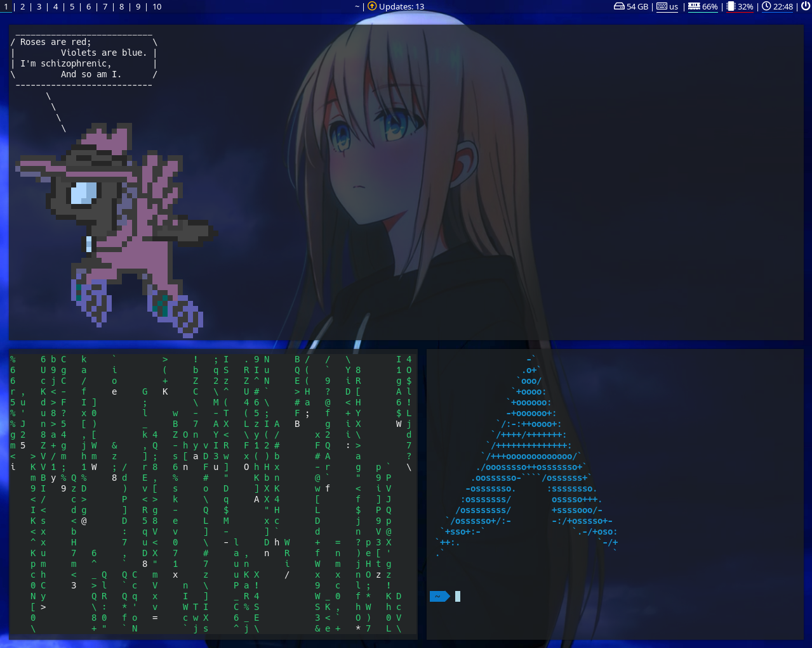

# bspwm-config-files
These are my personal config files. 

I'm posting them here as a backup, but if you found it by any chance, feel free to use it. 

I will try to improve that so in case if someone(could be me) forgot what the commands means or just don't know, it will explain it. 

I almost forgot the 
[Wallapaper](https://wallpapersden.com/blonde-blue-eye-anime-girl-wallpaper/2880x1800/) 

Here's how it looks like: 

That's it, stay safe whoever reading this ❤  
